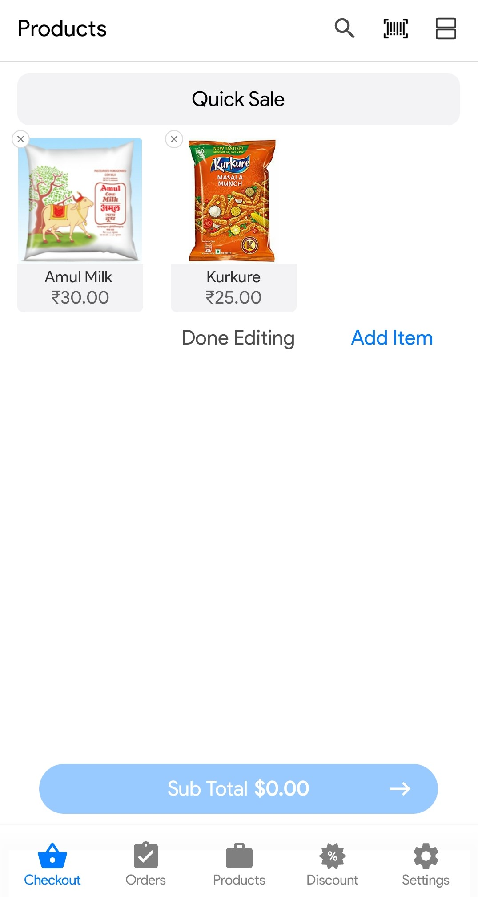
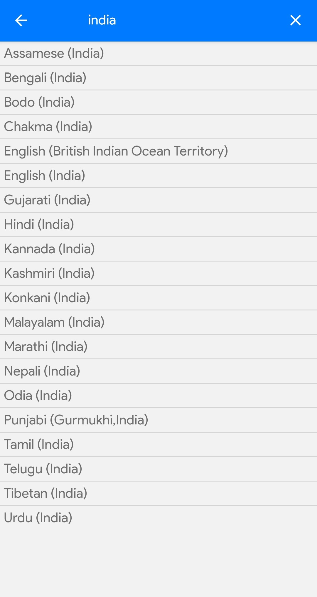
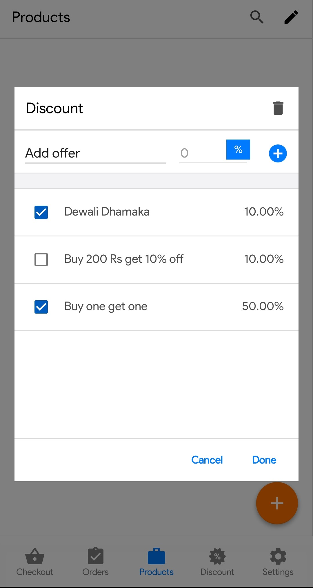
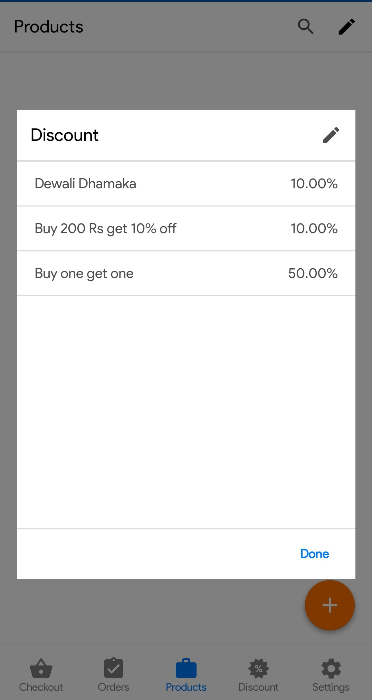
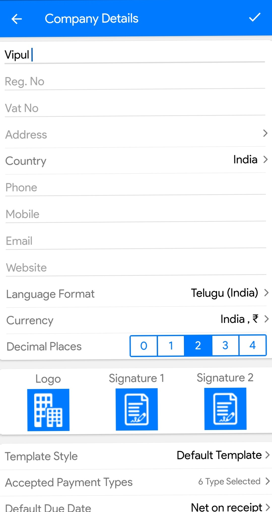
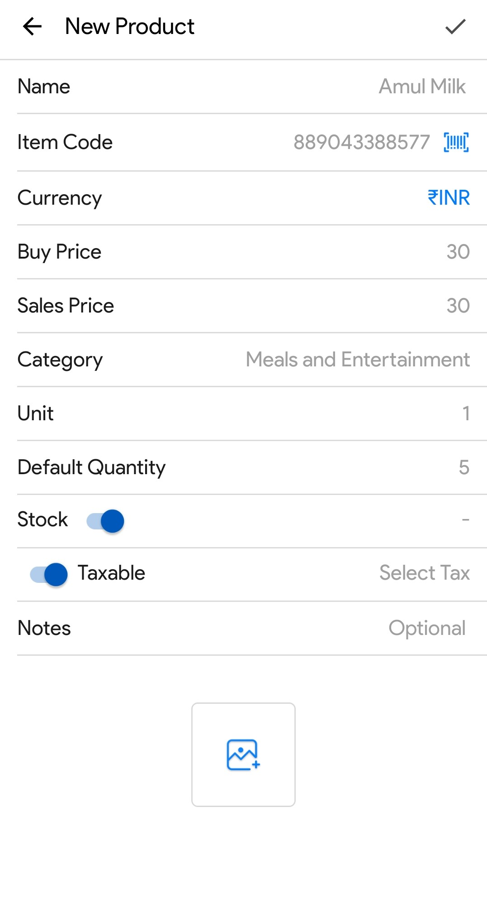

# FOX-A An AI Based POS App

###

## SUMMERY

I needed an embedded scanner when I was developing, and I just looked for information online and most of them I found are talking about using "Intent" to do it but I want an embedeed one. However, I found this [Create Barcode Scanner For Android Using Kotlin, Part 2](https://ariefbayu.xyz/create-barcode-scanner-for-android-using-kotlin-part-2-63656fa02609), it saved my life.

## Preview

